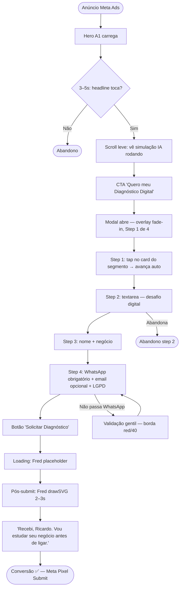
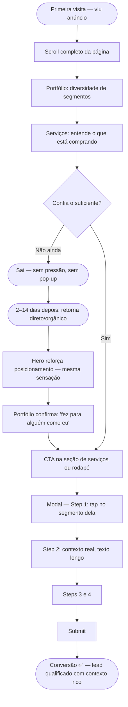
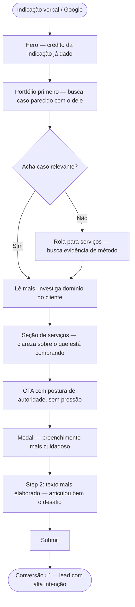
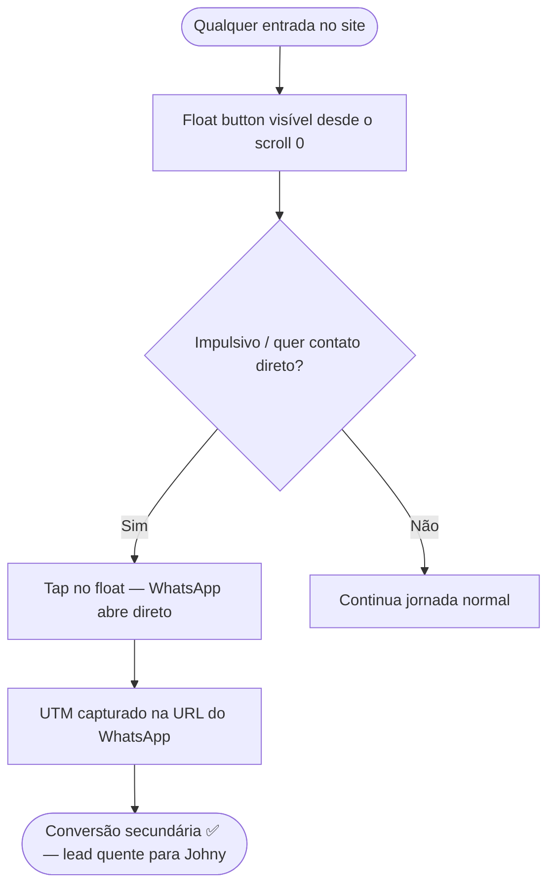

# UX Design Specification digital-dog

**Author:** Johny
**Date:** 2026-03-10

---

<!-- UX design content will be appended sequentially through collaborative workflow steps -->

## Executive Summary

### Project Vision

O site da Digital Dog é o motor de captação da operação — uma landing page de alta conversão que transforma visitantes vindos de Meta Ads em Diagnósticos Digitais agendados. Não é portfólio institucional: é infraestrutura de vendas.

O reposicionamento parte de um site existente focado em clínicas veterinárias para um site universal de Arquitetura Digital — sem trocar a stack técnica, mas reconstruindo completamente a experiência, o copy e a jornada de conversão.

**Tom central do site:** oportunidade através da novidade — não medo, não urgência artificial. O visitante deve sentir "existe um jeito que ainda não tentei" e "esse parceiro vai resolver o meu problema real."

**Identidade visual consolidada:**
- Fred: cachorro em linha (husky/pastor) com óculos gradiente laranja→pink — já existe como SVG, ideal para animação de stroke
- Paleta: cyan `#00bcd4` (estrutura/identidade) + gradiente `#ff6b35→#ff1744` (ação/energia/CTAs)
- Tipografia: Space Grotesk (headings) + Inter (corpo)
- Estética: dark tech, glow effects, animações fluidas e convidativas — nunca urgentes
- Logo subtext a atualizar: "Desenvolvimento Web" → "Arquitetura Digital"

### Target Users

**Dr. Ricardo — O Advogado Invisível** *(Meta Ads, mobile, conversão rápida)*
35–50 anos, profissional liberal estabelecido. Pesquisou o próprio nome no ChatGPT, não apareceu. Chega pelo anúncio no celular à noite. Precisa entender a proposta em segundos e ter um caminho claro para o formulário. Converte se o hero tocar na oportunidade certa — não na dor.

**Dra. Carla — A Cética Que Já Foi Enganada** *(ciclo longo, alta desconfiança)*
28–42 anos, já investiu em 3 agências sem resultado. Rola a página inteira, analisa o portfólio, lê os serviços com atenção. Ciclo de decisão de 2–4 semanas. O site precisa sustentar a releitura sem urgência artificial ou pressão. Sente-se vista quando o site reconhece sua situação sem julgá-la.

**João Dentista — A Pesquisa Silenciosa** *(indicação, validação)*
Chegou por indicação, pesquisou no Google. Mais tempo no site, foca em portfólio e serviços. O site precisa honrar o crédito que a indicação já deu — postura de autoridade, não de convencimento.

**Johny — O Admin** *(operação interna)*
Recebe notificação de lead por email com dados do formulário, acessa WhatsApp do lead, atualiza portfólio via CMS sem precisar de código.

### Key Design Challenges

**1. Credibilidade imediata no mobile (3–5 segundos)**
Visitante vem de Meta Ads sem contexto prévio. O hero precisa comunicar "esse cara é diferente" em uma respirada — headline que aponta para onde o negócio *pode chegar*, visual que transmite autoridade forward-looking, CTA único sem ambiguidade.

**2. Formulário como experiência, não obstáculo**
Substituir "WhatsApp direto" por formulário aumenta fricção percebida. Solução: modal multi-step conversacional de 4 steps com progressive disclosure. O WhatsApp é pedido apenas no step 4, contextualizado como canal de *entrega do diagnóstico*. Barra de progresso visível. Máximo 3 campos por step.

**3. Site como âncora de credibilidade durante ciclo longo**
Visitante que não converteu volta em dias ou semanas. O site não pode ter elementos de urgência artificial, pop-ups de pressão ou contadores regressivos. Precisa resistir à releitura com a mesma sensação da primeira vez.

**4. Fred pós-submit como pico emocional**
A tela de confirmação é o momento mais memorável do MVP. Fred (SVG) sendo "desenhado" traço a traço via GSAP `drawSVG` — contorno do rosto → orelhas → óculos com gradiente preenchendo. Tom humano no texto: *"Recebi. Vou estudar o seu negócio antes de ligar."* — não linguagem de sistema.

### Design Opportunities

**1. Fred como elemento UX, não só branding**
Arte linear do Fred é ideal para animação de stroke. Pode aparecer no pós-submit (nascendo), no Hub de Ferramentas teaser (como personagem do futuro), e como micro-interação em momentos-chave da jornada.

**2. AIO/GEO como prova visual**
O próprio site da Digital Dog sendo indexado por IAs pode ser demonstrado visualmente — screenshot/mockup de ChatGPT citando a marca, ou elemento que mostra a metodologia em ação antes de vender.

**3. Portfólio como "proof of range"**
Clientes vet existentes (RZ Vet, Aumivet, Morgan e Ted, Vet em Casa, Mundo Bicho) passam a ser prova de que a metodologia funciona em diferentes segmentos — não evidência de nicho veterinário.

**4. Dois caminhos de conversão complementares**
- **WhatsApp float** (rastreado por UTM): lead quente, impulsivo, quer falar agora — conversão secundária
- **Formulário de diagnóstico**: lead qualificado, pensativo, quer ser entendido — conversão primária (Meta Pixel event Submit)

## Core User Experience

### Defining Experience

**A ação central é uma só: o visitante submete o formulário de Diagnóstico Digital.**

Tudo no site existe para remover obstáculos entre a chegada (anúncio Meta) e esse momento. Cada seção, cada elemento visual, cada linha de copy serve a esse funil — ou justifica sua existência como credibilidade que reduz o atrito para chegar lá.

O segundo caminho — WhatsApp float — captura o perfil impulsivo que não quer formulário. É complementar, não concorrente.

### Platform Strategy

| Dimensão | Decisão |
|---|---|
| **Plataforma primária** | Web mobile (Safari iOS — tráfego Meta Ads) |
| **Plataforma secundária** | Desktop (pesquisa orgânica, João Dentista validando) |
| **Interação** | Touch-first; mouse/teclado como camada de polish |
| **Offline** | Não necessário — SSG via Next.js, carrega rápido em 4G |
| **Capacidades nativas** | Nenhuma — performance > features nativas |
| **Constraint crítico** | LCP < 2.5s mobile — Ad Quality Score do Meta depende disso |

### Effortless Interactions

**Zero fricção aqui — qualquer hesitação é abandono:**

- **Abrir o modal de diagnóstico** → um tap em qualquer CTA da página, modal abre suave com overlay
- **Avançar no formulário** → tap no card de segmento (step 1), sem digitar nada para começar
- **Acionar o WhatsApp** → botão float sempre visível, um tap, abre WhatsApp direto
- **Scroll entre seções** → smooth scroll com Lenis, animações de reveal que não bloqueiam leitura
- **Voltar um step no form** → seta discreta, sem perder o que já digitou

**O que deve ser invisível (automático):**
- Meta Pixel disparando PageView e Submit sem configuração do usuário
- UTM sendo capturado e associado ao lead automaticamente
- Notificação de email chegando para Johny sem ação manual

### Critical Success Moments

**Momento 1 — O hero convence em 3 segundos** *(make-or-break)*
Se o visitante não sentir "isso é diferente / isso fala comigo" antes de rolar, abandona. O headline precisa nomear a oportunidade — não o problema. Fred visualmente presente já no hero comunica a personalidade antes de qualquer palavra.

**Momento 2 — Step 1 do form: seleção visual sem digitar**
Primeiro campo do formulário é tap em um card (segmento de negócio). Zero esforço de entrada. Se o step 1 exigir digitação, a taxa de abandono do form dispara.

**Momento 3 — Pós-submit: Fred animado + mensagem humana**
Fred sendo desenhado traço a traço enquanto aparece a mensagem: *"Recebi. Vou estudar o seu negócio antes de ligar."* É aqui que o visitante decide se foi uma experiência genérica ou algo diferente. Esse momento precisa ser impecável.

**Momento 4 — Portfólio sustenta a segunda visita (Dra. Carla)**
Quando ela volta depois de dias pensando, o portfólio precisa responder silenciosamente: "sim, ele fez para alguém parecido comigo." Diversidade de segmentos visível sem precisar explicar.

### Experience Principles

1. **Oportunidade, não medo** — cada elemento aponta para onde o negócio *pode chegar*, nunca para o que está *perdendo*
2. **Um caminho por seção** — nenhuma seção tem dois CTAs concorrentes; o próximo passo sempre é óbvio
3. **Movimento que convida, não persegue** — animações fluidas com `prefers-reduced-motion` respeitado; nunca pulsando com ansiedade
4. **Humano no pico emocional** — onde mais importa (pós-submit), a linguagem é de pessoa para pessoa, não de sistema para usuário
5. **Confiança antes de conversão** — portfólio e serviços existem para que a Dra. Carla chegue ao CTA já convencida, não pressionada

## Desired Emotional Response

### Primary Emotional Goals

**Emoção primária: Oportunidade percebida através da novidade**
O visitante deve sentir que descobriu algo que ainda não existia para ele — não uma agência a mais, mas uma categoria diferente. A sensação é de *"por que ninguém fazia isso antes?"*

**Emoção secundária: Confiança de que o problema real vai ser resolvido**
Não a confiança superficial de um site bonito — a confiança de quem leu algo e pensou *"esse cara entende exatamente o que está travando o meu negócio."*

**Emoção diferenciadora: Ser visto sem julgamento**
Visitantes chegam carregando histórico de frustração com agências anteriores. O site reconhece a situação sem julgar — fazendo o visitante sentir que *"finalmente alguém entende como cheguei até aqui."*

### Emotional Journey Mapping

| Momento | Emoção desejada | Emoção a evitar |
|---|---|---|
| **Chegada (hero, 0–3s)** | Curiosidade → Reconhecimento | Indiferença, ceticismo imediato |
| **Exploração (scroll)** | Credibilidade crescente → Confiança | Sobrecarga, confusão |
| **Portfólio** | *"Fez para alguém como eu"* → Identificação | Dúvida, irrelevância |
| **Serviços** | Clareza → *"Entendo o que estou comprando"* | Jargão, abstração |
| **CTA / abertura do form** | Leveza → Decisão natural | Pressão, urgência ansiosa |
| **Form step 1–3** | Engajamento → Investimento progressivo | Fricção, impaciência |
| **Form step 4 (WhatsApp)** | Confortável para compartilhar | Desconfiança, invasão |
| **Pós-submit (Fred)** | Alívio + Entusiasmo + *"Fiz a coisa certa"* | Frieza sistêmica, genérico |
| **Segunda visita (Dra. Carla)** | Confirmação → Decisão consolidada | Estranheza, pressão nova |

### Micro-Emotions

**Confiança** *(crítica)* — construída progressivamente pelo portfólio real, copy sem jargão, ausência de promessas mirabolantes.

**Entusiasmo** *(diferenciador)* — sensação de ter encontrado algo novo. Vem do posicionamento como categoria própria, de Fred com personalidade, e do formulário que parece uma conversa.

**Leveza** *(no formulário)* — step 1 sem digitar nada, progresso visível, sem campos que assustam. Fácil avançar — e fácil parar se quiser.

**Pertencimento** *(pós-submit)* — Fred sendo desenhado + mensagem humana cria a sensação de ter entrado em algo, não apenas cadastrado em algo.

### Design Implications

| Emoção | Decisão de UX/Design |
|---|---|
| Oportunidade/novidade | Headline aponta para o futuro, não para a falha atual. Gradiente cyan→laranja no hero transmite energia forward |
| Confiança | Portfólio com logos reais + diversidade de segmentos. Copy de serviços direto, sem superlativo |
| Ser visto sem julgamento | Sem urgência artificial, sem pop-ups. Espaço negativo generoso no layout |
| Leveza no form | Step 1 = seleção visual (cards). Barra de progresso visível. Placeholder empático nos campos de texto |
| Pertencimento pós-submit | Fred SVG animado com stroke draw. Texto em primeira pessoa: *"Recebi. Vou estudar o seu negócio antes de ligar."* |
| Entusiasmo | Micro-animações de reveal ao scroll. Fred com óculos gradiente como símbolo de ver mais longe |

### Emotional Design Principles

1. **Reconhecimento antes de persuasão** — o site nomeia a situação do visitante antes de propor qualquer solução
2. **Confiança é construída, não declarada** — portfólio e metodologia provam sem afirmar superioridade
3. **Cada micro-interação reforça leveza** — hover states suaves, transitions fluidas, formulário que avança sem esforço
4. **O pico emocional é planejado** — pós-submit com Fred é o único momento de surpresa positiva deliberada do site
5. **Ausência como design** — o que *não está* no site (urgência, pressão, jargão, pop-ups) é tão importante quanto o que está

## UX Pattern Analysis & Inspiration

### Inspiring Products Analysis

**Referência 1 — Vyrtech (vyrtech.com/locacao-de-roupas#servicos)**
*Relevância: SVG animation style, dark premium aesthetic*

SVGs animados via `stroke-dasharray` + `stroke-dashoffset` — efeito de "fluxo desenhando" em elementos geométricos com `cubic-bezier` para movimento orgânico. Padrões: `map-flow` (stroke progressivo em paths), `radius-breathe` (opacity pulsante em círculos), `pin-pulse` (oscilação em pontos). Background near-black com SVG como único ornamento — zero blob gradients, zero partículas. Minimalista mas vivo.

**Referência 2 — Vercel / Perplexity / Claude.ai**
*Relevância: nível editorial, precisão pixel a pixel, contenção como autoridade*

Tipografia como arquitetura. Hierarquia por peso e tamanho, não por cor. Botões contidos: `border: 1px solid` com fill suave no hover, sem glow pulsante no default. Divisórias entre seções: linha 1px com opacidade mínima. Espaço negativo agressivo e intencional. Layouts que parecem ter sido tomados por alguém com opinião — não gerados por template.

**Referência 3 — Identidade atual da Digital Dog**
*Relevância: DNA a preservar e evoluir*

Dark tech com cyan + gradiente laranja→pink já funciona. `AnimatedGradient` com orbs flutuantes — **remover** (cara de IA genérica 2023). Cards com glow on hover — **manter e refinar**. Fred como SVG linear — potencial de animação de stroke não explorado.

### Transferable UX Patterns

**Animação SVG técnica (adotar):**
- `stroke-dasharray` + `stroke-dashoffset` para desenhar elementos geométricos ao scroll
- `opacity` pulsante em círculos/dots decorativos — sutil, não distrativo
- Flow animado em linhas conectoras dentro de cards de serviço
- Fred pós-submit com GSAP `drawSVG` — mesmo princípio, controle de sequência

**Background com parallax (adotar):**
- Três camadas: fundo estático (grid/linhas técnicas SVG), camada SVG em parallax lento, conteúdo em velocidade normal
- `useScroll` + `useTransform` do Framer Motion para depth sem peso no bundle
- Grid técnico sutil (`1px` lines, `opacity: 0.04`) como textura arquitetural no hero

**Progressive reduction na nav (adotar):**
- Logo completo (SVG Fred + "Digital Dog") em repouso
- No scroll (~80px): texto do logo sai suavemente, só o SVG do Fred permanece
- Hambúrguer: 3 linhas de `1px`, gap de `4px`, sem label, sem animação dramática
- Nav container: `backdrop-blur-sm` + `border-bottom: 1px solid rgba(255,255,255,0.06)`
- Mobile menu: overlay full-screen, links grandes, fundo near-black com blur — sem slide lateral

**Estilo editorial fino (adotar):**
- Botões: border `1px solid` com baixa opacidade no default, fill suave no hover
- Divisórias de seção: `1px solid rgba(255,255,255,0.08)` — linha, não gradiente
- Cards: borda fina, background quase transparente com `backdrop-blur`
- Tipografia: `clamp()` agressivo nos headings, Space Grotesk Bold como elemento visual
- Letter-spacing calibrado: `0.05em` em labels e badges

### Anti-Patterns to Avoid

| Anti-pattern | Por que remover |
|---|---|
| `AnimatedGradient` com orbs flutuantes | Clichê de landing page 2023, cara de IA genérica |
| Gradient blobs animados como fundo | Substituir por grid técnico SVG |
| Glow em múltiplos elementos simultaneamente | Diluí impacto; reservar para CTAs e momentos únicos |
| Botões com `shadow-glow` pulsante no default | Gritante, não refinado |
| Timeline vertical numerada (How It Works) | Padrão mais batido de landing page — substituir |
| Fred centralizado e grande no hero | Tira foco do headline; Fred fica na nav |
| Gradiente dramático entre seções | Substituir por linha 1px |
| Slide lateral de menu mobile | Ultrapassado — substituir por overlay full-screen |

### Design Inspiration Strategy

**Filosofia central:** "Nível Awwwards sem o carnaval" — execução de alta precisão, zero performance visual desnecessária. Cada animação justifica sua existência ou não existe.

**Três princípios derivados das referências:**
1. **Contenção como autoridade** — marcas que sussurram já provaram. Sem pop-ups, sem urgência, sem botão laranja pulsante
2. **Precisão como personalidade** — cada `1px`, cada `0.08s` de delay, cada decisão tipográfica diz "alguém pensou nisso"
3. **SVG como linguagem** — os SVGs animados comunicam "arquitetura digital" antes de qualquer texto; são o produto traduzido visualmente

**Substituição da seção How It Works:**
Em vez de timeline linear, adotar **diagrama de ecossistema** — nós conectados por linhas animadas (SVG stroke) representando Marca ↔ Site ↔ SEO ↔ AIO ↔ Automações. Comunica "sistema integrado" visualmente antes de qualquer explicação textual.

## Design System Foundation

### Design System Choice

**Custom Design System sobre Tailwind CSS** — é o que já existe e é exatamente o que as referências (Vercel, Perplexity, Claude.ai) usam. O sistema atual em `tailwind.config.ts` tem tokens próprios. Os componentes em `features/shared/ui/` são a biblioteca existente. O trabalho é **refinar e expandir**, não reconstruir.

### Rationale

| Fator | Decisão |
|---|---|
| **Unicidade visual** | Custom obrigatório — MUI/Chakra entregaria cara de template |
| **Stack existente** | Tailwind + tokens já configurados — custo de migração zero |
| **Referências** | Vercel, Linear, Perplexity são todos custom sobre Tailwind |
| **Solo dev** | Biblioteca própria leve > framework externo pesado para manter |
| **Animações** | Framer Motion + GSAP não dependem de design system externo |
| **Performance** | Bundle mínimo — só o que for usado |

### Implementation Approach

**Tokens a refinar no `tailwind.config.ts`:**
- `border-subtle`: `rgba(255,255,255,0.06)` — divisórias finas entre seções
- `border-default`: `rgba(255,255,255,0.12)` — cards, inputs, nav
- `text-label`: Inter uppercase, `letter-spacing: 0.08em`, 11–12px — badges e labels
- Cyan e gradiente laranja→pink: manter paleta, **restringir uso** a CTAs e momentos de destaque

**Componentes a refinar (existentes):**
- `Button` → border `1px solid`, sem glow default, fill suave no hover
- `Card` → borda mais fina, background mais transparente com `backdrop-blur`
- `Badge` → reduzir peso visual, mais editorial

### Customization Strategy

Manter arquitetura `features/shared/ui/`. Adicionar:
- `TechBackground.tsx` — SVG técnico com parallax (Framer Motion `useScroll`)
- `FredAnimated.tsx` — Fred SVG com GSAP `drawSVG` para pós-submit
- `DiagnosticModal.tsx` — modal multi-step com barra de progresso
- `NavBar` com progressive reduction — logo completo → só Fred SVG no scroll, hambúrguer discreto

## Core User Experience — Defining Experience

### 2.1 Defining Experience

**"Preencher o Diagnóstico Digital e sentir que alguém vai resolver o meu problema de verdade."**

A experiência definidora não é o formulário em si — é a sensação de que essa conversa já é diferente de tudo que veio antes. Step 1 sem digitar, progresso visível, campo de texto livre onde o visitante articula a própria dor, e Fred nascendo na tela como confirmação de que algo real começou.

### 2.2 User Mental Model

**O que o visitante traz:**
- Experiência prévia de formulários que nunca geraram retorno
- Desconfiança com "diagnóstico gratuito" — associa com pretexto para vender pacote
- Hábito de WhatsApp como contato rápido e sem compromisso
- Expectativa de que formulário = muitos campos = perda de tempo

**O que precisamos reescrever:**
- Formulário como *conversa*, não cadastro
- WhatsApp pedido no final como canal de *entrega*, não de captura
- Número de steps visível desde o início remove o medo do "quanto mais tem?"
- Placeholder específico e empático no campo de texto guia sem forçar

### 2.3 Success Criteria

| Critério | Indicador |
|---|---|
| **Fluência** | Visitante avança do step 1 ao 4 sem pausar para pensar |
| **Confiança** | Campo de texto preenchido com contexto real, não apenas uma palavra |
| **Investimento progressivo** | Taxa de abandono cai a cada step — quem chega ao step 3 raramente abandona |
| **Pico emocional** | Fred animado + mensagem humana recebidos antes de qualquer ação pós-submit |
| **Dado operacional** | Johny recebe email com segmento + desafio + WhatsApp — prepara abordagem antes de ligar |

### 2.4 Novel UX Patterns

**Padrão combinado de forma inovadora:**
- Step 1 como seleção visual (cards, não dropdown) — familiar como quiz, mais elegante
- Campo de texto livre *antes* do contato — cria reciprocidade: "compartilhei meu desafio, faz sentido deixar meu WhatsApp"
- Pós-submit como experiência, não confirmação — Fred animado é o twist que nenhum concorrente tem

**Metáforas familiares usadas:**
- Quiz progressivo estilo Typeform light para os steps
- "Iniciar processo" em vez de "enviar formulário" — linguagem de parceria, não de cadastro

### 2.5 Experience Mechanics

**Initiation:** Qualquer CTA "Quero meu Diagnóstico Digital" abre o modal com Framer Motion — overlay fade-in, modal sobe suave de baixo. Barra de progresso visível: `Step 1 de 4`.

**Interaction:**

- **Step 1** — "Qual é o seu tipo de negócio?" → Grid de cards com ícone SVG + label (Advocacia, Clínica/Saúde, Pet/Vet, Consultório, Outro). Tap no card avança automaticamente — zero botão "próximo".
- **Step 2** — "Qual é o seu maior desafio digital hoje?" → Textarea com placeholder empático. Mínimo 1 caractere para habilitar avanço.
- **Step 3** — "Como você se chama e qual é o nome do seu negócio?" → Nome + Nome do negócio. Validação gentil.
- **Step 4** — "Como prefere receber o diagnóstico?" → WhatsApp (obrigatório) + Email (opcional) + checkbox LGPD discreto. Botão "Solicitar Diagnóstico" com destaque visual.

**Feedback:**
- Barra de progresso avança com transição suave a cada step
- Erro de validação: borda `border-red/40` — gentil, não agressivo
- Loading no submit: Fred SVG em placeholder enquanto processa

**Completion:**
- Modal fecha, tela pós-submit ocupa o viewport
- Fred sendo desenhado via GSAP `drawSVG` (2–3s)
- Texto após Fred: *"Recebi, [Nome]. Vou estudar o seu negócio antes de entrar em contato."*
- Link discreto abaixo: *"Quer antecipar a conversa? → Fale agora"* (WhatsApp)
- X de fechar aparece após 1s — deixa o momento respirar

## Visual Design Foundation

### Sistema de Cores

**Filosofia:** Contenção como autoridade — a paleta é pouca e intencional. Cyan para estrutura e identidade; gradiente laranja→pink exclusivo para ação e energia. Background near-black como palco.

**Paleta base (tokens existentes):**

| Token | Valor | Uso |
|---|---|---|
| `primary-blue` | `#00bcd4` | Identidade, nav, elementos estruturais |
| `light-blue` | `#4dd0e1` | Variante hover, destaque secundário |
| `glow-blue` | `rgba(0,188,212,0.5)` | Glow em cards hover — uso restrito |
| `gradient-orange` | `#ff6b35` | Início do gradiente de ação |
| `gradient-pink` | `#ff1744` | Fim do gradiente — CTAs, Fred animado |
| `dark-blue` | `#0a0e1a` | Background padrão de seções |
| `darker-blue` | `#03050a` | Background mais profundo, modal overlay |

**Tokens semânticos a adicionar ao `tailwind.config.ts`:**

| Token | Valor | Uso |
|---|---|---|
| `border-subtle` | `rgba(255,255,255,0.06)` | Divisórias entre seções |
| `border-default` | `rgba(255,255,255,0.12)` | Cards, inputs, nav container |
| `text-muted` | `rgba(255,255,255,0.45)` | Texto secundário, labels discretos |
| `text-secondary` | `rgba(255,255,255,0.70)` | Corpo de texto, parágrafos |
| `text-primary` | `rgba(255,255,255,0.95)` | Headings, elementos de destaque |
| `surface-card` | `rgba(255,255,255,0.03)` | Background de cards com backdrop-blur |

**Regras de uso do gradiente laranja→pink:**
- CTAs primários ("Quero meu Diagnóstico Digital")
- Fred SVG pós-submit (óculos com preenchimento do gradiente)
- Máximo 1–2 ocorrências por viewport — reservar impacto

**Acessibilidade de cor:**
- Cyan `#00bcd4` sobre `#0a0e1a`: contraste ~4.8:1 — WCAG AA ✅
- Texto branco `0.95` sobre `#0a0e1a`: contraste ~17:1 ✅
- Gradiente como fundo de texto: somente em headings grandes (>32px)

### Sistema Tipográfico

**Filosofia:** Tipografia como arquitetura — hierarquia por peso e tamanho, não por cor. Space Grotesk como elemento visual além de fonte.

**Dupla tipográfica:**
- **Space Grotesk** (headings) — geométrica, técnica, personalidade sem ser decorativa. Mapeada como `font-heading` via `var(--font-heading)`.
- **Inter** (corpo) — legibilidade máxima em qualquer tamanho. Mapeada como `font-body`.
  > ⚠️ Fallback atual no config é `Poppins` — atualizar para `'Space Grotesk'` na importação real.

**Escala tipográfica com `clamp()`:**

| Nível | Valor | Uso |
|---|---|---|
| `h1` | `clamp(2.5rem, 6vw, 4.5rem)` | Hero headline principal |
| `h2` | `clamp(1.75rem, 4vw, 3rem)` | Títulos de seção |
| `h3` | `clamp(1.25rem, 2.5vw, 1.75rem)` | Subtítulos, cards |
| `body-lg` | `1.125rem` (18px) | Parágrafos principais |
| `body` | `1rem` (16px) | Corpo padrão |
| `label` | `0.6875rem` (11px) | Badges, labels uppercase |
| `caption` | `0.75rem` (12px) | Texto auxiliar, legenda |

**Regras tipográficas:**
- `letter-spacing: 0.08em` em labels uppercase (badges, categorias)
- `letter-spacing: 0.05em` em subtítulos Space Grotesk médios
- `line-height: 1.1–1.2` em headings grandes (tight = presença)
- `line-height: 1.6–1.7` em parágrafos (legibilidade)
- `font-weight: 700` para h1/h2; `600` para h3; `400` para corpo

### Espaçamento e Layout

**Filosofia:** Espaço negativo agressivo e intencional — a generosidade de espaço é o sinal de contenção e autoridade.

**Base unit:** 8px

**Escala de espaçamento:**

| Token | Valor | Uso |
|---|---|---|
| `space-xs` | `4px` | Gap interno mínimo |
| `space-sm` | `8px` | Padding interno de componentes |
| `space-md` | `16px` | Gap entre elementos relacionados |
| `space-lg` | `24px` | Padding de cards |
| `space-xl` | `32px` | Separação entre grupos |
| `space-2xl` | `48px` | Separação entre subseções |
| `space-3xl` | `64px` | Padding vertical de seções mobile |
| `space-4xl` | `96px` | Padding vertical de seções desktop |
| `space-5xl` | `128px` | Separações maiores, hero padding |

**Grid e container:**
- Container max-width: `1280px`, padding horizontal `24px` mobile / `48px` desktop
- Layout padrão: single column mobile, até 12 colunas desktop com gaps de `24px`
- Seções hero: full-width com conteúdo centralizado até `768px`
- Seções portfólio/cases: grid `1→2→3` colunas responsivo

**Bordas e cantos:**
- Cards: `border-radius: 12px` padrão
- Modal: `border-radius: 16px`
- Badges: `border-radius: 999px` (pill)
- Botões: `border-radius: 8px` — contenção, não arredondamento excessivo

### Considerações de Acessibilidade

- **Motion:** `prefers-reduced-motion` respeitado em todas as animações — fallback sem transição, sem stroke draw do Fred
- **Focus:** anel de foco visível em cyan `#00bcd4` com `outline-offset: 2px` — nunca `outline: none` sem substituto
- **Contraste:** Mínimo WCAG AA em todos os textos; preferência AA+ em texto de corpo
- **Touch targets:** Mínimo `44×44px` em todos os elementos interativos mobile (step cards do form, botões de nav)
- **Semântica:** Headings em ordem hierárquica; landmarks HTML5 (`main`, `nav`, `section`, `footer`)
- **Screen readers:** `aria-label` em ícones decorativos; Fred SVG com `aria-hidden="true"`

## Design Direction Decision

### Direções Exploradas

Seis direções visuais foram exploradas dentro do vocabulário **Technical Brutalism** (v1), seguidas de quatro variações refinadas (v2) com matte black real, acento duplo e anatomia de card definida:

| Direção | Conceito | Resultado |
|---|---|---|
| D1 Split Monolith | Hero split, Fred visual à direita, cards com anatomia técnica | ✅ Selecionada |
| D2 Statement Column | Headline tipográfica central, "DIGITAL" como textura de fundo | ✅ Selecionada (base complementar) |
| D3 Data Grid | Serviços como tabela, sidebar com form preview | Referência para seção de serviços |
| D4 Asymmetric Tension | Grid irregular, tensão tipográfica | Descartada para MVP |

### Direção Escolhida

**Hero: A1 — Google/Gemini + ChatGPT Simulation** ✅ *Decisão final do stakeholder*

A direção A1 do showcase v3 foi selecionada como hero definitivo do MVP. Estrutura split mantida (D1), mas o painel direito passa a ser uma simulação animada de IA em vez do Fred + anéis.

**Anatomia do Hero A1:**
- **Esquerda:** Headline "Quando seu cliente consultar a IA, o seu negócio vai **aparecer**?" com gradiente em `aparecer` (`.gu`), eyebrow "AIO · GEO · ARQUITETURA DIGITAL", sub copy, CTA primário + trust strip com nomes de clientes
- **Direita:** Painel de simulação com chrome de browser — alterna entre Google (com Gemini AI Overview mostrando clientes reais) e ChatGPT (thread conversacional), em loop com 3 queries e 3 clientes via GSAP TextPlugin
- **Efeito:** demonstra o produto *antes* de qualquer explicação — o visitante *vê* o negócio do cliente aparecendo no Gemini/ChatGPT

**Seções internas:** cards com anatomia de ficha técnica (D1), serviços como tabela linha a linha (D3 como referência)

### Sistema de Acento Duplo (decisão final)

| Elemento | Cor | Uso |
|---|---|---|
| Cyan `#00bcd4` | Frio, estrutural | Borda esquerda `2px` nos cards, índices `01/02`, Fred na nav, separadores de seção, rings concêntricos |
| Gradiente `#ff6b35 → #ff1744` | Quente, assinatura do Fred | Sublinhado de headline (`.gu`), números de destaque, óculos do Fred em todo SVG, stat de métricas, CTA primário |
| Background `#0a0a0a` | Preto fosco | Sem temperatura azulada — parece papel impresso, não tela |

### Rationale

**Por que D1 + D2 funcionam para a Digital Dog:**
1. **Compatibilidade com SVG/GSAP** — os anéis concêntricos e o grid técnico do hero são naturalmente animáveis com `stroke-dasharray` e `opacity` progressiva; a tipografia dominante do D2 funciona como âncora estática enquanto o SVG respira ao redor
2. **Credibilidade imediata mobile** — o split expõe o Fred no primeiro viewport sem rolar, comunicando personalidade antes de qualquer palavra
3. **Escalabilidade de conteúdo** — a anatomia de card com divisores internos e dados reais sustenta releitura (Dra. Carla) sem precisar adicionar elementos novos

### Approach de Implementação

**Componentes novos a criar:**
- `HeroAISimulation.tsx` — painel direito do hero: alterna Google (Gemini AI Overview) / ChatGPT com GSAP TextPlugin, loop por queries + clientes reais
- `TechBackground.tsx` — SVG de grid técnico com parallax lento via Framer Motion `useScroll`
- `ServiceCard.tsx` — card com borda cyan esquerda, índice, divisor interno, dado técnico no rodapé
- `GradUnderline` — utility class `.gu` para sublinhado de headline com gradiente Fred

**Animações planejadas:**
- Hero mount: stagger de entrada no conteúdo esquerdo (clip-path + y-transform) + simulação iniciando no painel direito
- Loop da simulação: TextPlugin "digitando" queries, fade entre Google e ChatGPT, highlight do card do cliente
- Card hover: `border-left` de transparent → cyan com `0.15s ease`
- Pós-submit: Fred SVG completo sendo desenhado traço a traço (GSAP `drawSVG`, 2–3s)

### Evolução: Showcase v4 Disruptivo (Testes GSAP)

Para elevar a experiência e consolidar o posicionamento de "Arquitetura Digital", desenvolvemos a iteração **UX Showcase v4**, focada em testar componentes avançados de GSAP e criar um layout propositalmente disruptivo (baseado na direção D4 - Asymmetric Tension combinada com a precisão do D1).

**Novos Padrões Implementados no V4:**
1. **Custom Cursor Dinâmico**: Um cursor circular sutil que se expande sobre elementos interativos (`.active`), aumentando a sensação tátil e premium em desktop.
2. **Smooth Scrolling (Lenis)**: Integração com a biblioteca Lenis para garantir que os ScrollTriggers do GSAP funcionem com fluidez absoluta.
3. **Hero H1 Mega em Stagger**: Animação de entrada do headline (clip-path + y-transform) que revela as palavras "Future Architecture" com impacto pesado.
4. **Grid Parallax Assimétrico (`#hero-grid`)**: O fundo técnico rotacionado em 3D (Z e X) move-se em ritmos diferentes do conteúdo durante o scroll, comunicando profundidade.
5. **Moving Marquee Contínuo**: Uma faixa contínua e infinita exibindo as principais tecnologias (SEO, AIO, Next.js, GSAP) com design outlined (`-webkit-text-stroke`).
6. **Reveal Pegajoso do Formulário (Sticky Transform)**: A transição de leitura para a ação final usa um modal/formulário que parece "fundo infinito", crescendo e ganhando opacidade à medida que o card container trava na tela.

Essa experimentação confirma que podemos usar micro-interações intensas sem perder a performance. O pacote `gsap` + `gsap-ScrollTrigger` se sobressai na entrega de um UX diferenciado para C-Levels e donos de negócio que buscam "o que há de mais moderno" sem a lentidão visual de templates genéricos.

## User Journey Flows

### Jornada 1 — Dr. Ricardo: Conversão Mobile Direta

**Perfil:** Meta Ads, mobile (Safari iOS), primeira visita, 3–5s para decidir

### Jornada 2 — Dra. Carla: Ciclo Longo / Segunda Visita

**Perfil:** Já foi enganada por agências, volta após 2–4 dias, rola tudo

### Jornada 3 — João Dentista: Validação por Indicação

**Perfil:** Chegou por indicação, pesquisou no Google, tempo maior no site

### Jornada 4 — WhatsApp Float: Lead Quente / Impulsivo

**Perfil:** Qualquer origem, quer falar agora, não quer formulário

### Journey Patterns

| Pattern | Descrição | Ocorrência |
|---|---|---|
| **Single next step** | Cada seção tem um único CTA, sem concorrência | Todas as jornadas |
| **Progressive commitment** | Step 1 sem digitar → investimento cresce a cada step | Form (J1, J2, J3) |
| **No-pressure exit** | Sempre possível sair sem pop-up ou retenção | J2 especialmente |
| **Social proof inline** | Trust strip + portfólio responde dúvidas sem interromper fluxo | J1, J2, J3 |
| **Dual conversion path** | Float WA captura impulsivos; form captura pensativos | J1 + J4 complementares |

### Flow Optimization Principles

1. **Step 1 zero-friction** — seleção visual de segmento, nenhum campo de texto na abertura
2. **Mobile-first tap targets** — cards do step 1 com mínimo 44×44px, espaçados para toque gordo
3. **Progress sempre visível** — barra "Step X de 4" reduz o medo do "quanto falta?"
4. **Reciprocidade antes do contato** — WhatsApp pedido somente no step 4, após o visitante já ter compartilhado o desafio
5. **Pós-submit como recompensa** — Fred animado é o pico emocional planejado, não uma tela de sistema

## Component Strategy

### Componentes Existentes — Refinamento

| Componente | Status | Ação |
|---|---|---|
| `Button` | Refinar | Remover glow pulsante default → `border: 1px solid` com fill suave no hover |
| `Card` | Refinar | Borda mais fina, `background: rgba(255,255,255,0.03)` + `backdrop-blur` |
| `Badge` | Refinar | Reduzir peso visual, mais editorial, `letter-spacing: 0.08em` |
| `AnimatedGradient` | **Remover** | Clichê de landing page 2023 — substituído por `TechBackground` |
| `WhatsAppFloat` | Manter | Adicionar captura de UTM na URL |
| `Input` | Manter | Ajustar estados de erro para `border-red/40` (gentil, não agressivo) |
| `ImageWithFallback` | Manter | Sem alteração |
| `MetaPixel` | Manter | Sem alteração |
| `CustomCursor` | Avaliar | Manter apenas desktop, desabilitar em touch |

### Custom Components

#### `HeroAISimulation`
**Propósito:** Painel direito do Hero A1 — demonstra o produto antes de qualquer explicação textual
**Anatomia:** Chrome de browser (dots + URL) → painel Google (Gemini AI Overview animado) → painel ChatGPT (thread conversacional)
**States:** `google-typing` → `google-result` → `chatgpt-typing` → `chatgpt-result` → loop
**Variants:** Loop com 3 queries × 3 clientes reais (Aumivet, Morgan & Ted, RZ Vet)
**Interação:** Automático, sem input do usuário; `prefers-reduced-motion` → versão estática
**Acessibilidade:** `aria-hidden="true"` — elemento decorativo/demonstrativo

#### `DiagnosticModal`
**Propósito:** Formulário de conversão primária — 4 steps com progressive disclosure
**Anatomia:** Overlay → Modal (16px radius) → ProgressBar → StepContent → Actions
**States:** `step-1` | `step-2` | `step-3` | `step-4` | `submitting` | `success`
**Step 1:** Grid de `SegmentCard` (tap avança automático — sem botão next)
**Step 2:** Textarea com placeholder empático, mínimo 1 char para habilitar next
**Step 3:** Input nome + Input nome do negócio
**Step 4:** Input WhatsApp (obrigatório) + Input email (opcional) + Checkbox LGPD discreto
**Erro:** `border-red/40` — gentil, inline, sem shake agressivo
**Acessibilidade:** `role="dialog"`, `aria-modal="true"`, trap de foco, `Escape` fecha

#### `SegmentCard`
**Propósito:** Seleção visual no Step 1 — zero digitação na abertura do form
**Anatomia:** Ícone SVG + Label + borda cyan no selected
**Variants:** Advocacia / Clínica·Saúde / Pet·Vet / Consultório / Outro
**States:** `default` | `hover` (border cyan aparece) | `selected` (fill sutil + borda 2px cyan)
**Interação:** Tap/click → seleciona e avança para step 2 automaticamente
**Touch target:** Mínimo 44×44px

#### `ProgressBar`
**Propósito:** "Step X de 4" — remove medo do "quanto falta?"
**Anatomia:** Track (8px height) + Fill (gradiente laranja→pink) + Label "Passo X de 4"
**Animação:** Fill avança com `transition: width 0.3s ease` a cada step

#### `FredAnimated`
**Propósito:** Pico emocional pós-submit — Fred SVG sendo desenhado traço a traço
**Anatomia:** SVG Fred (husky/pastor com óculos gradiente) + texto humano abaixo
**Animação:** GSAP `drawSVG` — contorno → orelhas → óculos com gradiente preenchendo (2–3s)
**Texto:** *"Recebi, [Nome]. Vou estudar o seu negócio antes de entrar em contato."*
**Link discreto:** "Quer antecipar a conversa? → Fale agora" (WhatsApp) aparece após animação
**Acessibilidade:** `prefers-reduced-motion` → Fred aparece estático instantaneamente

#### `TechBackground`
**Propósito:** Grid técnico SVG como textura arquitetural (substitui AnimatedGradient)
**Anatomia:** SVG de linhas 1px (`opacity: 0.04`) em parallax lento com Framer Motion `useScroll`
**Variants:** `hero` (grid + parallax) | `section` (grid estático, sem parallax)

#### `ServiceCard`
**Propósito:** Card de serviço com anatomia de ficha técnica
**Anatomia:** Borda esquerda `2px` cyan | Índice (`01`, `02`...) | Título | Descrição | Divisor interno `1px` | Dado técnico no rodapé
**States:** `default` (border-left transparent) | `hover` (border-left cyan, `transition: 0.15s ease`)

#### `PortfolioCard`
**Propósito:** Case de portfólio — prova de range de segmentos
**Anatomia:** Logo do cliente + Segmento badge + Resultado (1 linha) + Link discreto
**Grid:** 1 col mobile → 2 col tablet → 3 col desktop

### Component Implementation Strategy

Todos os componentes custom são construídos sobre os tokens Tailwind existentes em `tailwind.config.ts`. Nenhuma dependência externa de UI (sem MUI, sem Chakra). Framer Motion para parallax/transitions; GSAP para animações de alta precisão (`drawSVG`, `TextPlugin`, `ScrollTrigger`).

### Implementation Roadmap

**Fase 1 — Críticos para conversão:**
- `HeroAISimulation` — hero é o make-or-break de toda a jornada
- `DiagnosticModal` + `SegmentCard` + `ProgressBar` — conversão primária
- `FredAnimated` — pós-submit / pico emocional

**Fase 2 — Credibilidade e suporte:**
- `ServiceCard` — entendimento do que está sendo comprado (Dra. Carla)
- `PortfolioCard` — prova de range (João Dentista + Dra. Carla)
- `TechBackground` — substituição do AnimatedGradient

**Fase 3 — Polish:**
- Refinamento de `Button`, `Card`, `Badge`
- Progressive reduction na `NavBar`
- `MarqueeBar` de tecnologias (opcional MVP)

## UX Consistency Patterns

### Button Hierarchy

| Nível | Estilo | Uso |
|---|---|---|
| **Primário** | Background gradiente laranja→pink, `border-radius: 8px`, texto branco | Um por viewport — CTA principal |
| **Secundário** | `border: 1px solid rgba(255,255,255,0.20)`, background transparente, hover fill sutil | Ações de suporte, links de navegação |
| **Ghost** | Sem borda, sem background, hover com underline ou opacity | Links internos, "Voltar" no form, "Fale agora" pós-submit |

**Regras:**
- Máximo 1 botão primário por seção visível
- **Copy contextual por posição:** hero → "Quero meu Diagnóstico Digital" / seção serviços → "Solicitar Diagnóstico" / rodapé → "Pronto para começar?" — mesma ação, gancho emocional adaptado ao momento da jornada
- Botão primário sem `box-shadow` pulsante no default — glow apenas no hover
- `min-height: 44px` mobile; `padding: 12px 24px` desktop

### Feedback Patterns

**Erro de validação:**
- `border: 1px solid rgba(239,68,68,0.40)` no input — sutil, não agressivo
- Mensagem inline abaixo do campo, `font-size: 12px`, `color: rgba(239,68,68,0.80)`
- Sem shake/vibração

**Loading:**
- Botão de submit: texto some, spinner discreto no lugar
- `DiagnosticModal` durante submit: Fred SVG placeholder com opacity baixa

**Sucesso:**
- Reservado exclusivamente para pós-submit (`FredAnimated`) — sem banners genéricos
- Progresso no form: barra avança, nada mais

### Form Patterns

**Entrada preferida: seleção visual antes de digitação**
- Step 1 sempre visual (cards) — zero typing para iniciar
- Campos de texto aparecem apenas no step 2+

**Labels e placeholders:**
- Label acima do campo, `font-size: 12px`, uppercase, `letter-spacing: 0.08em`
- **Step 2 placeholder:** aberto e convidativo — *"Conte o que está travando o seu negócio hoje"* — não um exemplo que ancora a resposta; cria espaço para o visitante surpreender
- Placeholder some no foco — não flutua

**Botão de avanço:**
- Step 1: automático ao selecionar card
- Steps 2–4: "Continuar →" habilitado após mínimo de input
- Step 4: "Solicitar Diagnóstico" com gradiente — é o CTA final

**Botão submit + teclado iOS:**
- `position: fixed` no botão de submit com `padding-bottom` dinâmico via `visualViewport.height`
- Previne o botão ficar escondido atrás do teclado virtual no iPhone (step 4)

**Campos obrigatórios vs. opcionais:**
- WhatsApp: obrigatório, sem asterisco — contexto explica
- Email: `(opcional)` em cinza discreto ao lado do label

### Navigation Patterns

**NavBar — Progressive Reduction:**
- `0–80px` scroll: logo completo (Fred SVG + "Digital Dog") + links
- `>80px` scroll: texto do logo some suavemente, apenas ícone Fred permanece
- Background: `backdrop-blur-sm` + `border-bottom: 1px solid rgba(255,255,255,0.06)` no scroll

**NavBar como anti-exit passivo:**
- CTA sempre visível na NavBar — conversão a um scroll de distância sem bloquear saída
- Sem exit-intent popup. Sem overlay de retenção. A filosofia "sem pressão" se aplica ao exit.

**Mobile menu:**
- Overlay full-screen, near-black com blur — sem slide lateral
- Links grandes (`font-size: 24px`), espaçamento generoso
- Fecha em tap fora ou no X

### Modal e Overlay Patterns

**Abertura:** overlay `fadeIn 0.2s`, modal `slideUp 0.25s`
**Fechamento:** X discreto (aparece após 1s no pós-submit), `Escape`, tap no overlay
**Stacking:** máximo 1 modal — nunca modal sobre modal
**Acessibilidade:** `role="dialog"`, `aria-modal="true"`, trap de foco
**iOS keyboard:** `visualViewport.height` para reposicionar botão submit quando teclado sobe

### Empty States e Loading

**PortfolioCard sem imagem:** `ImageWithFallback` com placeholder visual — **regra editorial:** o card nunca aparece sem segmento + resultado em texto. Imagem é opcional, contexto não é.
**Loading de página:** SSG — sem loading perceptível; sem skeletons na landing
**Estado de submit:** Fred placeholder + spinner inline no botão

### Micro-interactions

| Elemento | Interação | Timing | Nota técnica |
|---|---|---|---|
| Cards de serviço | `color: transparent → cyan` no `border-left` (width sempre `2px`) | `0.15s ease` | Manter `width: 2px` fixo — só mudar cor. Evita CLS |
| Botões secundários | opacity `1.0` → `0.7` + fill sutil no hover | `0.12s ease` | — |
| Links de nav | underline no hover | `0.1s ease` | — |
| Float WhatsApp | scale `1.0` → `1.05` no hover | `0.2s ease` | — |
| Reveal de seções | `opacity 0 + y 20px` → `opacity 1 + y 0` | `0.5s ease`, stagger `0.1s` | `will-change: opacity, transform` explícito — previne layer surpresa no Safari iOS |

**Regra geral:** animações que *informam* → máximo `0.2s`. Animações que *encantam* → até `0.6s`. Nunca looping por padrão exceto `HeroAISimulation` e `MarqueeBar`.

## Responsive Design & Accessibility

### Responsive Strategy

**Mobile-first absoluto** — o layout nasce no mobile e escala para desktop.

| Dispositivo | Foco | Comportamento |
|---|---|---|
| **Mobile** (< 768px) | Primário — tráfego pago | Single column, hero split empilha (visual acima, copy abaixo), touch targets 44px+, form otimizado para teclado iOS |
| **Tablet** (768–1023px) | Secundário | 2 colunas em cards de portfólio e serviços; hero mantém split; form sem mudanças |
| **Desktop** (≥ 1024px) | Secundário — validação orgânica | Hero A1 split 1:1 completo, max-width 1280px centralizado, hover states ativados, `HeroAISimulation` em tamanho pleno |

**Hero A1 em mobile:**
- Coluna de texto ocupa 100% da largura
- `HeroAISimulation` vem abaixo — reduzido mas funcional, sem chrome excessivo
- `prefers-reduced-motion` → simulação exibe resultado estático sem animação de digitação

### Breakpoint Strategy

Tailwind breakpoints padrão — mobile-first:

| Token | Valor | Layout trigger |
|---|---|---|
| `default` | 0–767px | Mobile single column |
| `md` | 768px | 2 colunas em grids |
| `lg` | 1024px | Hero split ativo, nav completa |
| `xl` | 1280px | Max-width do container |

### Accessibility Strategy

**Meta: WCAG 2.1 AA**

**Contraste:**
- Cyan `#00bcd4` sobre `#0a0a0a`: ~4.8:1 ✅ AA
- Branco `0.95` sobre `#0a0a0a`: ~17:1 ✅
- Gradiente como background de texto: apenas em headings ≥ 32px

**Keyboard navigation:**
- Tab / Shift+Tab / Enter / Space / Escape
- Skip link: "Ir para o conteúdo principal" — visível apenas no foco, primeiro elemento do DOM

**Focus indicators:**
- `outline: 2px solid #00bcd4`, `outline-offset: 2px` — nunca removido sem substituto

**Screen readers:**
- `HeroAISimulation`: `aria-hidden="true"`
- `FredAnimated`: `aria-hidden="true"` + texto alternativo visível abaixo
- `DiagnosticModal`: `role="dialog"`, `aria-labelledby` para título do step, `aria-describedby` para instruções
- Headings em ordem hierárquica: `h1` no hero, `h2` em seções, `h3` em cards

**LGPD/Formulário:**
- Checkbox com label clicável + link para política em nova aba

### Testing Strategy

**Dispositivos prioritários:**
- iPhone 13/14 Safari iOS — perfil Dr. Ricardo
- Android médio Chrome — cobertura de mercado
- MacBook Safari + Chrome desktop

**Acessibilidade:**
- Axe DevTools / Lighthouse no CI
- VoiceOver (iOS) — fluxo completo do form
- Navegação por teclado — tab order do hero até pós-submit
- Simulação de daltonismo (Deuteranopia)

**Performance:**
- LCP < 2.5s mobile em 4G
- `font-display: swap` em Space Grotesk e Inter
- `HeroAISimulation` não bloqueia LCP

### Implementation Guidelines

**Responsivo:**
- `rem` para tipografia, `%`/`vw` para containers, `px` apenas para borders e shadows
- `clamp()` nos headings (já definido)
- `next/image` com `sizes` correto; screenshots em `.webp`

**Acessibilidade:**
- Ordem do DOM = ordem visual
- `tabIndex` apenas quando necessário; nunca `tabIndex > 0`
- `DiagnosticModal`: ao abrir, foco vai para título do step; ao fechar, foco retorna ao elemento de origem
- `prefers-reduced-motion`: desabilitar GSAP e Framer Motion; exibir estados finais diretamente
